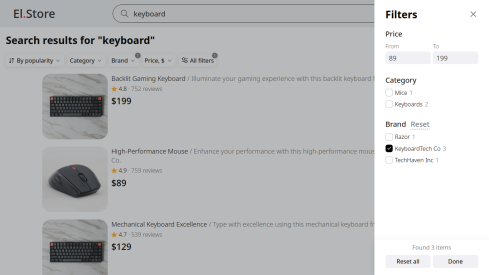

<br />


# About

Electronics Store is my pet project. My inspiration for it was a few popular online stores. The project features the ability to add items to the cart, an account system<!-- for saving the cart -->, search for items with filters, and more.

# How to run it locally

## Docker Compose

Run these commands:

```
docker-compose build
```

```
docker-compose up
```

The project should be running on [localhost:3000](http://localhost:3000).

## Manual

In both client and server folders run these commands:

1. Run `npm install` or `yarn` to install project dependencies.
2. Run `npm run dev` or `yarn dev` to run the project.

The project should be running on [localhost:3000](http://localhost:3000). Everything should work except the account system.

To be able to log into the account you must be running a MySQL database. If you have one, enter there the commands from the [mysql_init_scripts/init.sql](https://github.com/nentennens/electronics_store/blob/master/mysql_init_scripts/init.sql) file to configure the database and create the required tables.

You may also need to change the password for the database or some other variables in server .env, depending on your setup.

In order to send verification emails to the user upon registration, your SMTP email data must be entered into the server .env, but the project still will work without it.

Now everything should work great.
